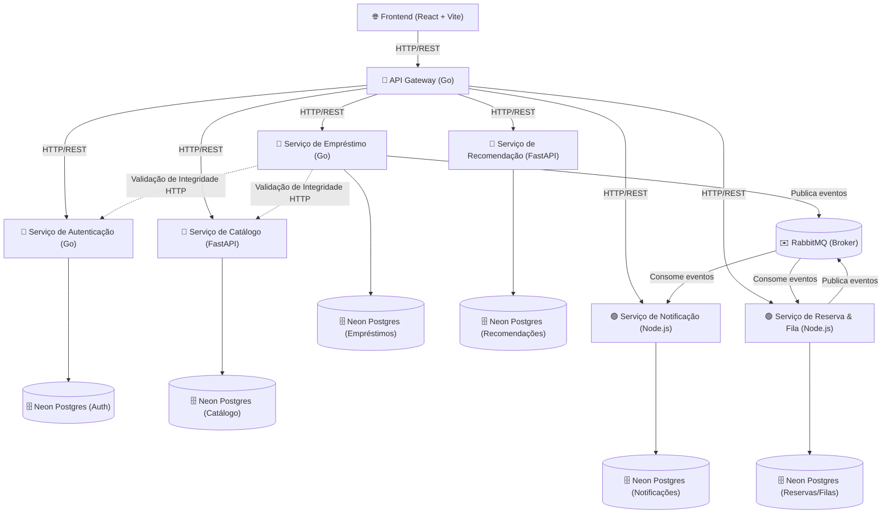

# 📚 Nosso Livro — Sistema Inteligente de Biblioteca Compartilhada

<p align="center">
  
  
  
  
</p>

O **Nosso Livro** é uma plataforma acadêmica e comunitária em arquitetura de microsserviços poliglota desenvolvida para gerenciar e simplificar o compartilhamento descentralizado de acervos físicos de livros entre membros de uma mesma instituição. 

O sistema integra múltiplas bibliotecas físicas, automatiza filas de reservas justas, rastreia empréstimos e fornece recomendações personalizadas baseadas nas preferências de leitura dos usuários.


## 🎯 Visão Geral do Projeto

### O Problema
Nas instituições de ensino e empresas, o compartilhamento informal de livros frequentemente falha devido à perda de rastreabilidade dos títulos, devoluções em atraso sem controle e falta de visibilidade centralizada sobre a disponibilidade física das obras nos diferentes pontos de coleta.

### A Solução
Uma plataforma centralizada que conecta os leitores com múltiplos pontos físicos de troca (bibliotecas), oferecendo:
* **Catálogo Unificado:** Busca em tempo real de livros e suas unidades físicas.
* **Empréstimo Transacional:** Validação rigorosa de prazos de entrega e devoluções.
* **Fila de Espera Automatizada:** Gerenciamento algorítmico da ordem de reserva de livros que estão emprestados.
* **Notificação Reativa:** Avisos automáticos de prazos e liberações de livros por e-mail/notificação.
* **Recomendações Inteligentes:** Sugestões personalizadas baseadas no comportamento leitor de cada usuário.

---

## 🏗️ Arquitetura e Fluxo de Integração

O projeto adota uma **Arquitetura de Microsserviços** distribuída e poliglota. Toda a comunicação de borda é centralizada através de um API Gateway próprio.



* **Comunicação Síncrona (REST):** Comunicação entre o Cliente (React) e o API Gateway, e entre microsserviços para validações que exigem consistência imediata (Ex: verificar se um usuário existe antes de conceder um empréstimo).
* **Comunicação Assíncrona (RabbitMQ):** Tráfego de mensagens orientadas a eventos que disparam comportamentos secundários não bloqueantes para o usuário (Ex: disparar um e-mail de alerta após registrar uma devolução).

---

## 📁 Organização do Repositório (Monorepo)

A estrutura física do projeto separa as responsabilidades de forma organizada para simplificar o gerenciamento local:

```text
nosso-livro/ (Raiz do Monorepo)
├── frontend/                           # Interface Web Cliente em React (Vite/TS)
├── backend/                            # Diretório de APIs e Serviços do Sistema
│   ├── gateway-api/                    # Gateway de API central de borda (Go)
│   ├── servico-autenticacao-usuario/   # Autenticação e Gestão de Usuários (Go)
│   ├── servico-emprestimo/             # Controle de Empréstimos e Devoluções (Go)
│   ├── servico-catalogo-biblioteca/    # Catálogo e Estoque Físico de Livros (Python/FastAPI)
│   ├── servico-recomendacao/           # Motor de Recomendações de Leitura (Python/FastAPI)
│   ├── servico-reserva-fila/           # Fila de Espera e Lógica de Reservas (Node.js/TS)
│   └── servico-notificacao/            # Processador e Disparador de Alertas (Node.js/TS)
├── Documentos/                         # Checklists e Guias de Implementação de Telas
├── docker-compose.yml                  # Orquestrador local de infraestrutura
├── README.md                           # Guia Principal de Documentação
└── ESPECIFICAÇÕES.md                   # Fonte única de verdade de regras e arquitetura
```

---

## ⚙️ Ecossistema de Microsserviços

O backend é poliglota, combinando as linguagens com maior afinidade para cada finalidade técnica:

| Microsserviço | Linguagem / Stack | Banco de Dados | Responsável | Escopo e Finalidade |
| :--- | :--- | :--- | :--- | :--- |
| **Autenticação & Usuários** | Go (Golang) | PostgreSQL | Athos Inácio | Registro, Login, Geração de Tokens JWT e Perfil de Usuários. |
| **Empréstimos** | Go (Golang) | PostgreSQL | Athos Inácio | Controle de locações ativas, prazos, cálculos de atrasos e devoluções. |
| **Catálogo & Bibliotecas** | Python (FastAPI) | PostgreSQL | Cauã Herculano | Cadastro de livros físicos, categorias, quantidade em estoque e pontos de coleta. |
| **Recomendações** | Python (FastAPI) | PostgreSQL | Cauã Herculano | Análise do perfil do usuário para sugerir obras semelhantes baseadas em dados históricos. |
| **Reserva & Fila** | Node.js (TypeScript) | PostgreSQL | Marcus Vinícius | Controle algorítmico da ordem de espera de cada obra indisponível. |
| **Notificações** | Node.js (TypeScript) | PostgreSQL | Marcus Vinícius | Motor de disparo SMTP com templates HTML de alertas para e-mail/WhatsApp. |

---

## ✉️ Catálogo de Eventos (RabbitMQ)

Para sincronização assíncrona orientada a eventos, as filas utilizam as seguintes chaves de roteamento no broker:

1. **`emprestimo.criado`:** Disparado pelo `Serviço de Empréstimo` ao conceder um livro. Consumido pelo `Serviço de Notificação` para enviar o e-mail de confirmação contendo o prazo de devolução.
2. **`emprestimo.devolvido`:** Disparado pelo `Serviço de Empréstimo` no retorno do exemplar físico. Consumido pelo `Serviço de Notificação` (confirmação da entrega) e pelo `Serviço de Reserva e Fila` (para liberar o livro para o próximo da fila).
3. **`reserva.criada`:** Disparado pelo `Serviço de Reserva` quando o usuário entra na fila de espera de um livro. Consumido pelo `Serviço de Notificação` para confirmar a posição de ingresso na fila.
4. **`reserva.atribuida`:** Disparado pelo `Serviço de Reserva e Fila` ao alocar a vaga do livro disponível para o próximo usuário. Consumido pelo `Serviço de Notificação` para enviar um alerta de que o livro físico está disponível para retirada em até 48 horas.

---

## 🛠️ Como Executar o Ambiente Local

### Pré-requisitos
Certifique-se de possuir instalado em sua máquina:
* [Docker](https://www.docker.com/) e [Docker Compose](https://docs.docker.com/compose/)
* [Node.js](https://nodejs.org/) (Versão 18+)
* [Go](https://go.dev/) (Versão 1.20+)
* [Python](https://www.python.org/) (Versão 3.10+)

### Passo 1: Inicializando o Backend Completo (Docker Compose)
A nossa infraestrutura docker-compose já está configurada para subir **todos** os microsserviços do backend (APIs), RabbitMQ e os Bancos de Dados locais.
Na raiz do monorepo, execute:

```bash
docker-compose up -d --build
```
*Observação: A primeira execução pode demorar alguns minutos pois o Docker fará o build das imagens em Go, Python e Node.js. O serviço de Catálogo executará automaticamente a criação das tabelas e a injeção inicial de livros de exemplo no banco de dados.*

### Passo 2: Configurando o Frontend
O frontend do React não roda no Docker, ele precisa ser iniciado localmente para desenvolvimento:
1. Acesse o diretório do cliente web:
   ```bash
   cd frontend
   ```
2. Crie o seu arquivo de variáveis de ambiente com base no exemplo:
   ```bash
   cp .env.example .env
   ```
3. Instale as dependências e inicie:
   ```bash
   npm install
   npm run dev
   ```
O frontend estará acessível em `http://localhost:5173` e já estará conectado ao Gateway API (que roda no Docker na porta 3000).

### Passo 3: Executando Microsserviços Manualmente (Apenas se for alterar o código)
Caso você queira alterar o código de um microsserviço específico, basta parar aquele contêiner específico no Docker (`docker stop nome_do_container`) e rodá-lo localmente na sua máquina:
* **Serviços em Go:** `go run cmd/api/principal.go`
* **Serviços em Node.js:** `npm run dev`
* **Serviços em Python:** `uvicorn app.principal:app --reload --port <porta>`
* *Lembre-se de configurar o `.env` dentro da pasta do serviço apontando para o banco local (`localhost:5432`) ao invés do host do docker (`db:5432`).*

---

## 🗄️ Migrações de Bancos de Dados

Cada microsserviço é responsável exclusivo pela integridade e criação das suas tabelas no PostgreSQL. Sempre execute as migrações locais antes de interagir com as telas:

* No **Serviço de Autenticação & Usuários (Go):** Utiliza scripts SQL via `golang-migrate`.
* No **Serviço de Empréstimos (Go):** Executa scripts estruturados no início da aplicação.
* No **Serviço de Catálogo (Python):** Utiliza as migrações automatizadas com `Alembic`.
* No **Serviço de Reserva/Notificações (Node.js):** Executa `npx prisma migrate dev` para sincronizar os modelos TypeScript com o Postgres.

---

## 📝 Diretrizes de Desenvolvimento (Idioma e Código)

* **Idioma Obrigatório (PT-BR):** Seguindo o padrão acadêmico do projeto, todas as mensagens, comentários de código, documentações, rotas HTTP, payloads JSON, tabelas de banco e commits de versionamento devem ser escritos em **Português do Brasil**.
* **Padrões de Commit:** Recomendamos Commits Semânticos em português (Ex: `feat: adiciona controle de fila de espera`, `fix: corrige validacao de token expirado`).

---

## 👥 Equipe de Desenvolvimento

Conheça os integrantes do projeto responsáveis pela construção do **Nosso Livro**:

| Desenvolvedor | Responsabilidade Principal | GitHub |
| :--- | :--- | :--- |
| **Athos Inácio** | Frontend (React), API Gateway (Go), Autenticação (Go) e Empréstimos (Go) | [👤 @Athos-Danilo](https://github.com/Athos-Danilo) |
| **Cauã Herculano** | Catálogo & Bibliotecas (Python) e Recomendação (Python) | [👤 @cauahp](https://github.com/cauahp) |
| **Marcus Vinícius** | Reserva & Fila (Node.js) e Notificações (Node.js) | [👤 @marcusvgranja](https://github.com/marcusvgranja) |

---
<p align="center">Desenvolvido para fins de colaboração acadêmica e promoção da leitura compartilhada. 📖✨</p>
